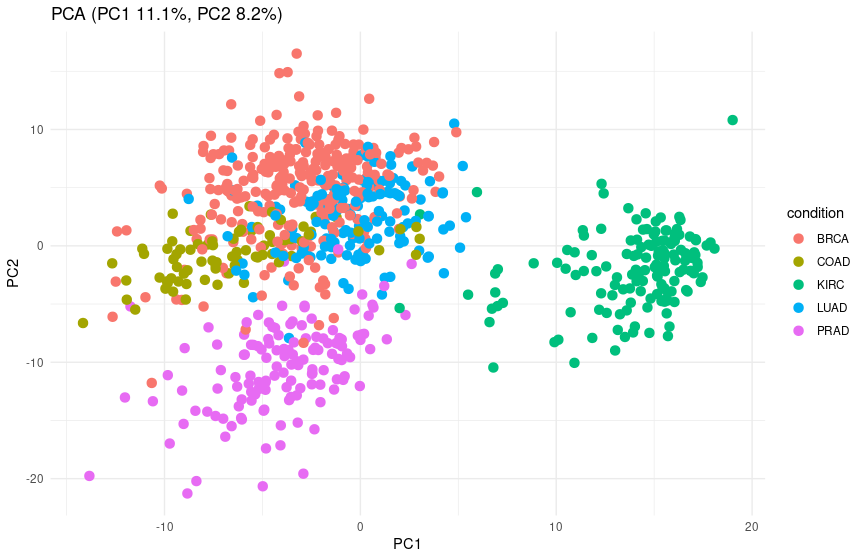
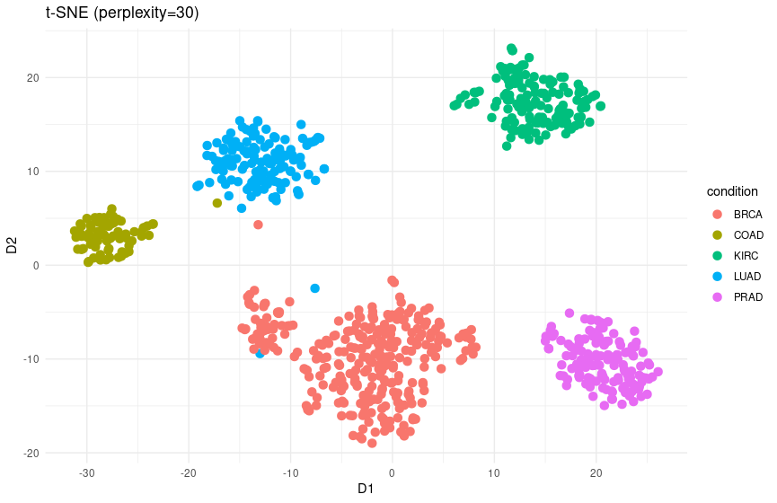
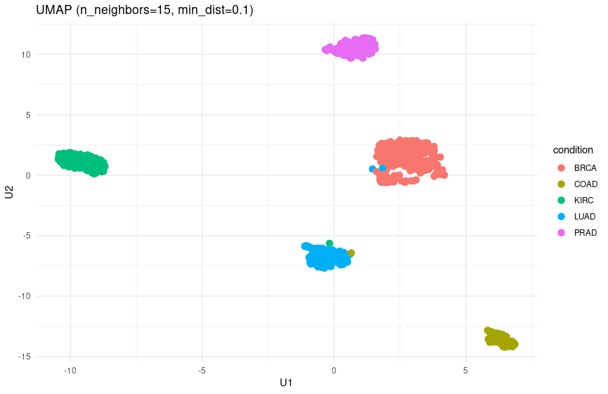
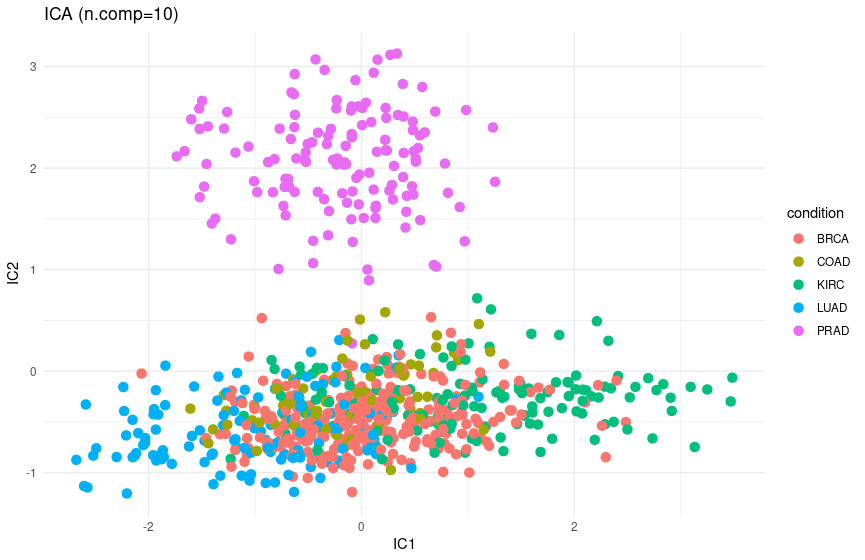

## Actividad 1 - Isabel María Rodríguez Alés

El objetivo de esta actividad es aplicar técnicas de aprendizaje no supervisado sobre datos biológicos de RNA-seq, con el fin de identificar patrones y diferencias entre distintos tipos de cáncer. Para ello, se han utilizado métodos de reducción de dimensionalidad como PCA, t-SNE, UMAP e ICA, que permiten visualizar las relaciones entre muestras y explorar la estructura subyacente de los datos sin utilizar información de etiquetas durante el análisis.

### 1. Dependencias y Librerías.

En primer lugar, se cargan las librerías necesarias para el análisis: paquetes de Bioconductor (DESeq2, edgeR, limma, sva, BiocGenerics) para normalización y transformación de datos de RNA-seq, y paquetes de CRAN (RDRToolbox, ggplot2, Rtsne, uwot, fastICA, cluster, patchwork, matrixStats) para reducción de dimensionalidad, clustering y visualización. El código asegura que todos los paquetes estén instalados y disponibles para su uso.

```{r}
if (!requireNamespace("BiocManager", quietly = TRUE))
  install.packages("BiocManager")
BiocManager::install("RDRToolbox")

bioc_pkgs <- c(
  "DESeq2",   # normalización VST / RNA-seq
  "edgeR",    # filtrado CPM, TMM
  "limma",    # voom / corrección batch
  "sva",      # ComBat batch correction
  "BiocGenerics"  # dependencias básicas
)

for (pkg in bioc_pkgs) {
  if (!requireNamespace(pkg, quietly = TRUE)) {
    BiocManager::install(pkg)
  }
}

library(RDRToolbox)
library(ggplot2)
library(Rtsne)
library(uwot)
library(fastICA)
library(DESeq2)
library(edgeR)
library(limma)
library(sva)
library(cluster)
library(patchwork)
library(matrixStats)
```

### 2. Carga de Datos.

A continuación, se cargan los archivos de datos de expresión génica (datos_500.csv) y de etiquetas de tipo de cáncer (labels.csv). Se convierten los valores de expresión a números enteros con round() para poder cumplir con los requisitos de DESeq2, y se extraen las etiquetas correspondientes a cada muestra. Después se verifica que el número de muestras coincida entre los datos y las etiquetas, asegurando la consistencia del dataset.

```{r}
data.raw <- read.csv('datos_500.csv')
labels.raw<- read.csv('labels.csv')

data <- round(sapply(data.raw[2:501], as.numeric))
labels <- labels.raw[,2]

stopifnot(nrow(data) == length(labels))

```

### 3. Preparación de Datos.

En la fase de preparación de datos, se filtran los genes que no se expresan nunca y también se eliminan las muestras sin expresión génicas. Tras eso, creamos un objeto DGElist para normalizar las diferencias de library size.

Para estabilizar la varianza de los genes aplicamos la transformación VST de DESeq2, con la que obtenemos una matriz de expresión con varianza homogénea.

Finalmente, los genes se escalan para que todos contribuyan de forma equitativa en los análisis de reducción de dimensionalidad.

```{r}
# Filtrar genes que nunca se expresan
keep_genes <- colSums(data) > 0
data_f <- data[, keep_genes]

# Filtrar muestras con todos los genes en cero
keep_samples <- rowSums(data_f) > 0
data_f <- data_f[keep_samples, ]
labels <- labels[keep_samples]

#NORMALIZACION
# edgeR espera: filas = genes, columnas = muestras
dge <- DGEList(counts = t(data_f))

# Normalización TMM para corregir diferencias de library size
dge <- calcNormFactors(dge)

# VST (Variance Stabilizing Transformation) con DESeq2
dds <- DESeqDataSetFromMatrix(
  countData = t(data_f),            
  colData   = data.frame(condition = labels),
  design    = ~1
)

vst_mat <- varianceStabilizingTransformation(dds, blind = TRUE)

# Extraer la matriz transformada
expr <- assay(vst_mat)

#Escalar genes
expr <- t(scale(t(expr)))
```

### 4. PCA.

La primera técnica que se aplica es Análisis de Componentes Principales (PCA). La aplicamos sobre la matriz de expresión génica escalada, proyectando las muestras en un espacio de menor dimensión. Se calculan los dos primeros componentes principales (PC1 y PC2) y se visualizan mediante un gráfico de dispersión, coloreando cada muestra según su tipo de cáncer.

```{r}

#Primera tecnica: PCA
pca_res <- prcomp(t(expr), center = TRUE, scale. = FALSE)
pct_var <- (pca_res$sdev^2)/sum(pca_res$sdev^2)
pca_df <- data.frame(PC1 = pca_res$x[,1], 
                     PC2 = pca_res$x[,2], 
                     condition = labels)

ggplot(pca_df, aes(PC1, PC2, color = condition)) +
  geom_point(size = 3) +
  labs(title = sprintf("PCA (PC1 %.1f%%, PC2 %.1f%%)", 100*pct_var[1], 100*pct_var[2])) +
  theme_minimal()
```

El gráfico de dispersión resultante es el que se muestra a continuación:



En el gráfico, que representa la proyección lineal de las muestras sobre los dos componentes principales, se observa que solo ciertos tipos de cáncer, concretamente KIRC y PRAD, forman grupos claramente diferenciados. Las demás muestras se encuentran más dispersas y no muestran agrupamientos evidentes.

### 5. t-SNE.

La segunda técnica que aplicamos es t-SNE, que es una técnica que preserva la estructura local de los datos. El parámetro perplexity controla cuántos vecinos se consideran al construir la proyección, y se va ajustando automáticamente en función del número de muestras. Cada punto en el gráfico representa una muestra y se colorea en función de su tipo de cáncer.

```{r}
#Segunda tecnica: t-SNE
set.seed(42)
perp <- min(30, floor(ncol(expr)/5))
tsne_res <- Rtsne(t(expr), dims = 2, perplexity = perp, pca = TRUE, verbose = TRUE, max_iter = 1000)
tsne_df <- data.frame(D1 = tsne_res$Y[,1], 
                      D2 = tsne_res$Y[,2], 
                      condition = labels)

ggplot(tsne_df, aes(D1, D2, color = condition)) +
  geom_point(size = 3) +
  labs(title = sprintf("t-SNE (perplexity=%d)", perp)) +
  theme_minimal()

```

El gráfico de dispersión resultante es el que se muestra a continuación:



Como podemos observar, los puntos correspondientes a un mismo tipo de cáncer se agrupan formando clusters bien definidos, mientras que los tipos diferentes quedan claramente separados. Esto indica que los perfiles de expresión génica permiten diferenciar las muestras de distintos tipos de cáncer, y que t-SNE es eficaz para visualizar estas relaciones no lineales. La separación observada es consistente con la biología del dataset y valida el uso de técnicas de reducción de dimensionalidad para explorar patrones en datos de RNA-seq.

### 6. UMAP.

La tercera técnica seleccionada ha sido UMAP, que es una técnica de reducción de dimensionalidad no lineal que preserva tanto la estructura local como global de los datos. Se utilizan 15 vecinos y una distancia mínima de 0.1 para construir la proyección en dos dimensiones.

```{r}
#tercera tecnica: UMAP
umap_res <- umap(t(expr), n_neighbors = 15, min_dist = 0.1, n_components = 2, verbose = TRUE)
umap_df <- data.frame(U1 = umap_res[,1], 
                      U2 = umap_res[,2], 
                      condition = labels)

ggplot(umap_df, aes(U1, U2, color = condition)) +
  geom_point(size = 3) +
  labs(title = "UMAP (n_neighbors=15, min_dist=0.1)") +
  theme_minimal()
```

El gráfico de dispersión resultante es el que se muestra a continuación:



Como podemos observar, los distintos tipos de cáncer forman clusters muy bien definidos y muestran una separación muy clara entre las muestras de los distintos grupos. Esto indica que UMAP es capaz de capturar patrones complejos de expresión génica y resalta relaciones no lineales que no se aprecian con PCA.

### 7. ICA.

La cuarta y última técnica aplicada ha sido ICA (Independent Component Analysis). ICA proyecta las muestras en componentes independientes que capturan señales estadísticamente no correlacionadas. Hemos calculado 10 componentes y se visualizan las dos primeras (IC1 y IC2) en un gráfico de dispersión coloreado según el tipo de cáncer.

```{r}
#cuarta tecnica: ICA
ica_res <- fastICA(t(expr), n.comp = 10, alg.typ = "parallel", fun = "logcosh", maxit = 200)
ica_df <- data.frame(IC1 = ica_res$S[,1], 
                     IC2 = ica_res$S[,2], 
                     condition = labels)

ggplot(ica_df, aes(IC1, IC2, color = condition)) +
  geom_point(size = 3) +
  labs(title = "ICA (n.comp=10)") +
  theme_minimal()
```

El gráfico de dispersión resultante es el que se muestra a continuación:



En el gráfico de ICA, que proyecta las muestras en componentes independientes, se observa que únicamente el tipo de cáncer PRAD forma un cluster claramente diferenciado. El resto de las muestras aparecen entremezcladas sin una separación evidente.

### 8. Resolución de las Preguntas de la Actividad.

1.  **Ambiente y Librerías de Trabajo:**

    **-¿Qué librerías han sido necesarias para llevar a cabo la implementación de\
    cada uno de los métodos de aprendizaje no supervisado? Explica el rol de los\
    argumentos de las funciones que has utilizado en cada método de reducción\
    de dimensionalidad**

    Para la implementación de los métodos de aprendizaje no supervisado se utilizaron las siguientes librerías:

    -   RDRToolbox -\> contiene funciones para técnicas de reducción de dimensionalidad como LLE o ISOMAP.

    -   Rtsne -\> para aplicar t-SNE, técnica de reducción no lineal que preserva relaciones locales. Argumentos clave: dims = 2 (número de dimensiones de salida), perplexity (número de vecinos considerados localmente), max_iter (número máximo de iteraciones).

    -   uwot -\> Implementa UMAP, para proyecciones que preservan estructura local y global. Argumentos clave: n_neighbors (número de vecinos para construir la proyección), min_dist (controla la separación mínima entre puntos en el espacio reducido), n_components (número de dimensiones de salida).

    -   fastICA -\> utilizada para aplicar ICA. Argumentos clave: n.comp (número de componentes independientes a calcular), alg.typ y fun (determinan el algoritmo y la función de contraste).

2.  **Procesamiento de los datos:**

    **¿Qué problemas has detectado en el conjunto de datos que te han sido\
    proporcionados? ¿Cómo los has solucionado?**

    En el conjunto de datos se detectaron una serie de problemas. En primer lugar, se encontraron genes sin expresión, es decir, genes con 0 en todas las muestras. Esto no aporta ningún tipo de información y puede afectar a la normalización. Para solucionarlo, se filtraron los genes cuya suma de expresión era 0.

    En segundo lugar, había muestras sin expresión, es decir, algunas muestras tenían todos los genes con valor cero. Para solucionarlo, se eliminaron esas muestras.

    En tercer lugar, había valores no enteros. DESeq2 requiere conteos enteros, pero los datos estaban en formato numeric. Para solucionar el problema, se redondearon los valores con count().

    Por último, era necesario normalizar los datos, ya que los conteos de RNA-seq tienen diferencias de library size entre muestras. Se aplicó normalización TMM con edgeR y transformación de varianza (VST) con DESeq2.

3.  **Métodos no supervisados:**

    **¿Cuál es el motivo por el cual has seleccionado estas técnicas de reducción\
    de dimensionalidad?**

    Se seleccionaron PCA, t-SNE, UMAP e ICA para cubrir distintos tipos de técnicas:

    -   PCA -\> lineal, rápida, permite interpretar la varianza.

    -   t-SNE -\> Detecta clusters localmente y es visualmente muy claro.

    -   UMAP -\> Preserva la estructura global y local y forma clusters muy claros. Es útil para visualizar clusters biológicos.

    -   ICA -\> Identifica señales independientes.

    **¿Qué aspectos positivos y negativos tienen cada una de las técnicas\
    escogidas?**

    | Técnica | Positivo | Negativo |
    |----|----|----|
    | PCA | Es rápida e interpretable. Muestra la varianza explicada | Solamente captura relaciones lineales. |
    | t-SNE | Detecta clusters locales y es visualemtne claro | No preserva distancias globales |
    | UMAP | Preserva estructura global y local | Los parámetros son sensibles y no tiene mucha interpretabilidad matemática. |
    | ICA | Identifica señales independientes. | Solo separa parcialmente los grupos, por lo que es difícilmente interpretable |

    **Comenta para cada caso el resultado de representar gráficamente las\
    primeras dos variables de cada uno de los métodos. ¿Qué se observa? ¿Tiene\
    sentido biológico? Razona tu respuesta**

    Cada comentario e interpretación de los gráficos se encuentra justo después de la imagen de cada uno de los diagramas de dispersión. Están ubicados en los puntos 4, 5, 6 y 7.
